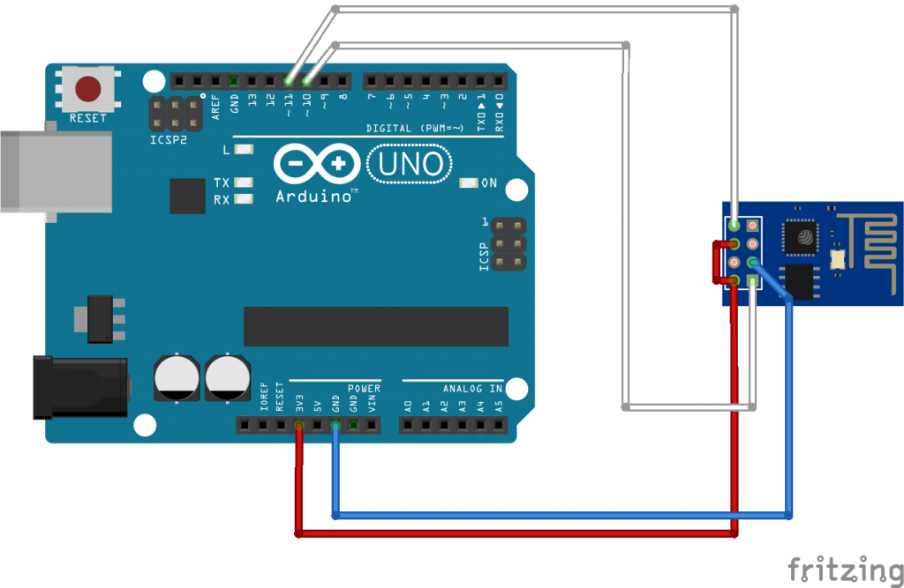

# DEVICE CONFIGURATION
## Requirements

### Hardware
- ESP8266 ESP-01 ( flash 1 MB - 80 MHz)
- ARDUINO UNO

### Software
- AESLib (https://github.com/suculent/thinx-aes-lib)
- ESP8226 lib: should be set in the preferences of the ide Arduino the following URL-> http://arduino.esp8266.com/stable/package_esp8266com_index.json

## (Important) AES encryption (MODE CBC)
### ENCRYPTION
1. encryption return an hex
2. hex is transformed in base64

### DECRYPTION
1. decode base64
2. the decrypted result is in base64
3. decode base64

## CONNECTING HARDWARE

**For uploading the code**  

 **For testing the code**
|Table 1|Table 2|

|  ESP01          |  ARDUINO         |
|-----------------|------------------|
|  TX             |  PIN11           |
|  GND            |  GND             |
|  CHPD           |  3.3V            |
|  GPIO2          |                  |
|  **GPIO0**      |  **GND**         |
|  RST	          |                  |
|  3.3V           |	 3.3V - 5V       |
|  RX             |	 PIN10           |

 **For testing the code**
 |  ESP01          |  ARDUINO         |
 |-----------------|------------------|
 |  TX             |  PIN11           |
 |  GND            |  GND             |
 |  CHPD           |  3.3V            |
 |  GPIO2          |                  |
 |  **GPIO0**      |                  |
 |  RST	           |                  |
 |  3.3V           |	 3.3V - 5V    |
 |  RX             |	 PIN10        |
